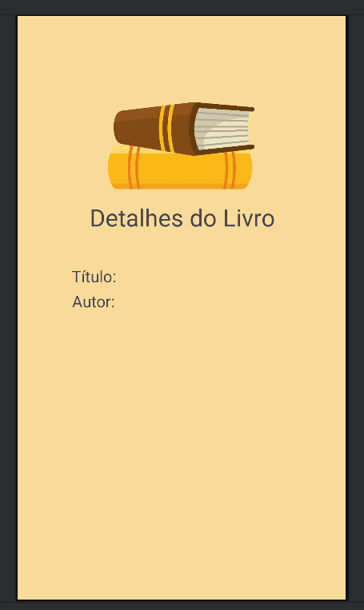

<h1 align="center">📚 App de Cadastro de Livros</h1>

<p align="center">
  Aplicativo Android desenvolvido em Kotlin para registrar livros e exibir suas informações<br>
  <strong>Tarefa da disciplina de Programação para Dispositivos Móveis</strong> 📱
</p>

<p align="center">
  
  
</p>

---

## 📱 Descrição

Este app permite ao usuário cadastrar um livro informando seu **título** e **autor**, e visualizar esses dados em uma segunda tela.


---
## 📸 Capturas de Tela
```markdown


